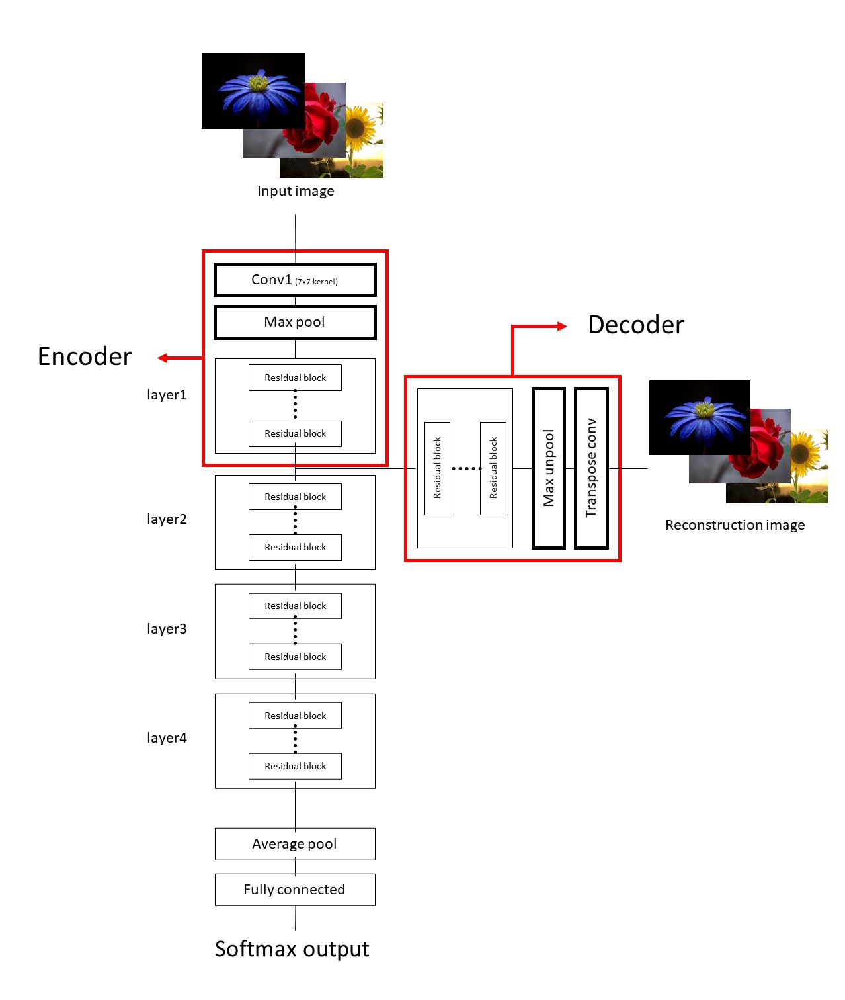

# AutoCNN

## 개요
Feature learning을 하는 AutoEncoder와 Image Classification(ResNet)을 같이 수행한 모델을 구현해 봤다.  
 
AutoEncdoer 부분의 학습은 GoogLeNet의 Auxiliary classifier와 같은 방식으로 학습된다.  
 
Auxiliary classification loss가 아닌 AutoEncoder이므로 reconstruction error(MSE loss)를 사용했다.

## Model

Baseline model: ResNet  
모델 구현시 참고한 코드: pytorch 공식 ResNet(https://github.com/pytorch/vision/blob/master/torchvision/models/resnet.py)  
 
Training scheme: GoogLeNet

### 모델에 대한 설명 
https://www.notion.so/AutoCNN-Network-a1067e509c24496d9dfd0ac953ef38b8

## 결과
Baseline이 되는 ResNet Classifier와 성능을 비교했을 때, 성능(정확도 및 학습 속도) 향상을 보여주지 못했다.  
